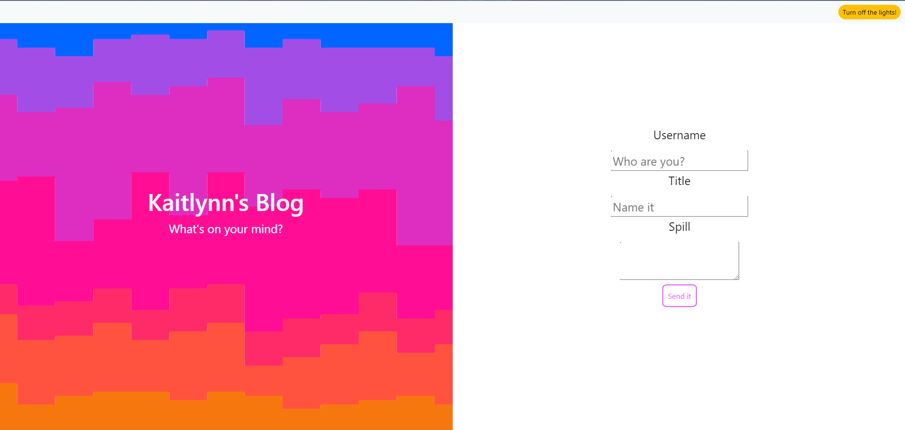

# <Personal Blog>

## Description

This project serves as blog space for users to share their thoughts. 

## Installation

This project can be accessed by copy and pasting this URL into any browser: https://khardigree.github.io/blog/

## Usage

This website is meant to be used as a blog and has two pages. The first page contains a form in which you enter your information. Once entered, you will be redirected to the secondary viewing page. 

## Credits

In collaboration with: 
The UNC Chapel Hill/EdX Full Stack Bootcamp

With special credits to: 

Siosaia Fonua

## License

MIT License 
---

